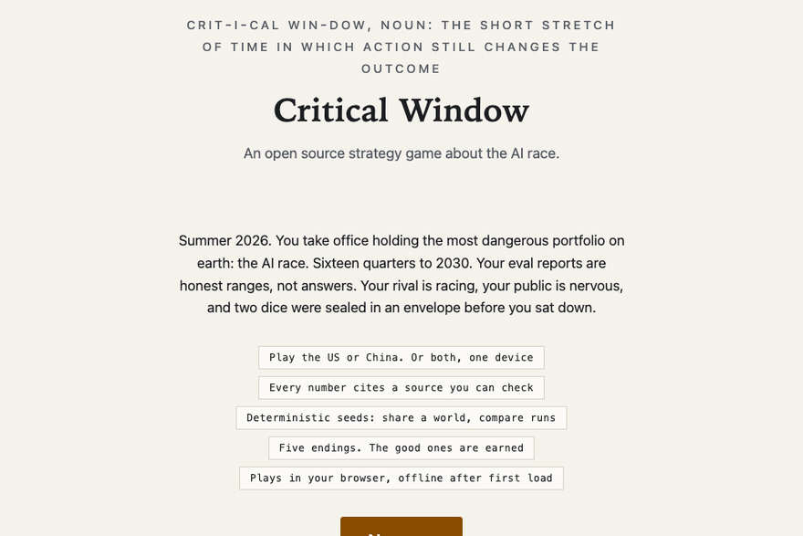
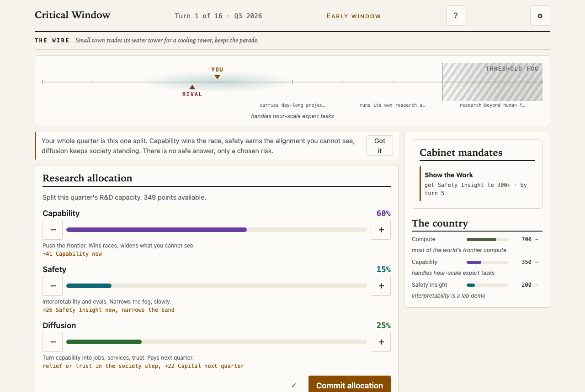

<p align="center"></p>

<h1 align="center">Critical Window</h1>

<p align="center"><b>An open source strategy game about the AI race.</b></p>

<p align="center">Nonprofit · No accounts, no tracking, ever · Works offline · Every number cites a source</p>

<p align="center">
<a href="https://github.com/chipmates/criticalwindow/actions/workflows/ci.yml"></a>
<a href="LICENSE"></a>
<a href="LICENSE-CONTENT"></a>
<a href="SECURITY.md"></a>
</p>

<p align="center"><a href="#play">Play</a> · <a href="SOURCES.md">Sources</a> · <a href="ROADMAP.md">Roadmap</a> · <a href="CONTRIBUTING.md">Contribute</a> · <a href="GOVERNANCE.md">Governance</a></p>



## Play

Clone and run it locally today:

```
pnpm install && pnpm dev
```

A hosted version arrives with the public alpha, and this line becomes a link when it ships. There is also a print-and-play paper kit: `pnpm print-kit` gives you a PDF with board, cards, rules, and one sealed envelope you are not allowed to open until the end.

Three ways to play. Solo as the United States. Solo as China, where the chips are scarce but the power is not. Hotseat: two people, one device, one shared world, two private screens of doubt.

## What a run feels like



Sixteen quarterly turns. Each one, you split your effort between capability, safety, and diffusion, then the world answers: memos with no clean options, incidents that leak the truth your eval reports smoothed over, a rival whose posture you can read but whose progress you can only watch. Five endings, and the good ones are earned. Losing tells you exactly why: the debrief opens the envelope and draws what your evals said each quarter against what was actually true.

Every number translates to something real. Compute 700 is most of the world's frontier training capacity. Capability 350 is systems that handle hour-scale expert tasks. The anchors come from published research, and the game shows you which.

## Why this game exists

Most people meet the AI race through headlines, and headlines do not teach how traps work. This game tries to give the felt version: deployment decisions you cannot verify, competitive pressure you did not choose, a society with its own clock. Whether racing or slowing down counts as winning is a question the game refuses to answer for you. Where the project goes next is in the [roadmap](ROADMAP.md); how decisions get made, including who arbitrates realism disputes, is in [GOVERNANCE.md](GOVERNANCE.md).

It is a nonprofit education project. No ads, no accounts, no tracking, ever ([SECURITY.md](SECURITY.md) says how to report anything that breaks that promise). Offline after first load. It runs on a school Chromebook.

## The iron rule

Every number in `data/` cites a source in `data/sources.json`, and `pnpm validate` fails when one does not. The rule runs in both directions: a source that claims to back numbers without actually being cited fails the build too, so the bibliography cannot quietly pad itself.

The registry is honest about what each source does. Some set numbers directly, and [SOURCES.md](SOURCES.md) lists every place each one is cited. Some shaped a mechanic without backing a single value, and each names the mechanic so the claim is checkable. The rest are the shelf we read from, listed as further reading and nothing more. [docs/EVIDENCE.md](docs/EVIDENCE.md) goes the other way: every cited value in the game, with its numbers, its kind, its sources, and the note that says how evidence became value. The same map is browsable inside the game, two clicks from the title screen.

Contested forecasts never become single numbers. They live as ranges inside the worldview preset you pick at setup, and a seeded hidden roll fixes the truth for your run inside that range. Design constants with no real-world referent say so and cite the design handover. Nothing pretends to be measured that is not.

Do not take our word for any of this: run `pnpm validate` yourself. If you change a value, your commit names the source. If you think a number is wrong, open a "challenge a number" issue with a better source. That argument is the project working as designed.

## For developers

```
pnpm install
pnpm dev          # run the app
pnpm test         # engine and data tests
pnpm validate     # schema + source + string integrity for all game data
pnpm simulate     # headless balance grid over seeded bot runs
pnpm print-kit    # generate the paper prototype PDF
```

The engine is a pure deterministic fold: same seed, same run, on every machine. Saves are action logs, replays are exact, and a shared seed means a shared hidden world. Lint enforces the purity. See [CONTRIBUTING.md](CONTRIBUTING.md) before touching `src/engine/`.

## Sound

Off by default, everything works silent. Music by Scott Buckley (CC BY 4.0), see [CREDITS.md](CREDITS.md). Voice narration is generated at build time from the game's own displayed text; nothing talks to a server while you play.

## License

Code: [AGPL-3.0](LICENSE). Game content (data, text, art): [CC BY-SA 4.0](LICENSE-CONTENT). The name stays ours so forks stay honest ([TRADEMARKS.md](TRADEMARKS.md)). The privacy claims are verifiable in this repository: there is no tracking code to find.
